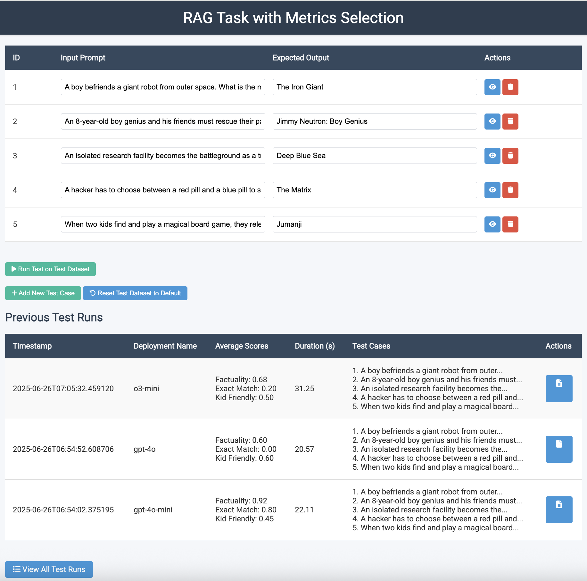

# autoeval-to-mongodb



---

### **autoeval-to-mongodb: An End-to-End Blueprint for Building and Validating a RAG System**

This project provides a complete, runnable blueprint for building, testing, and evaluating a Retrieval-Augmented Generation (RAG) application. In today's AI landscape, creating a RAG system is only half the battle; ensuring its reliability and accuracy is paramount. This repository addresses that challenge directly by integrating automated evaluation into the core development workflow.

We demonstrate a practical RAG use case: a movie lookup system that finds film titles based on plot descriptions. The project moves beyond theory and provides a hands-on implementation using a modern, powerful tech stack.

**Key Components:**

* **Database:** A local **MongoDB Atlas** instance running in **Docker**, populated with a sample movie dataset.
* **Intelligence Engine:** **MongoDB Atlas Vector Search** for semantic retrieval, coupled with **Azure OpenAI** for generating embeddings and final responses.
* **Core Logic:** A **Python** script that orchestrates the entire RAG pipeline from user prompt to final answer.
* **Automated Validation:** The **`autoevals` library** is used to systematically measure the system's factuality against a predefined test dataset, producing a quantitative performance score.

The outcome is a tangible demonstration of how to not only build a sophisticated AI system but also to generate a data-driven report card on its performance. This allows developers to iterate, measure improvements, and build more trustworthy AI applications.

### Prerequisites

* **MongoDB Tools:**
  * **mongosh:** The official MongoDB shell for interacting with MongoDB databases.
  * **mongorestore:** A tool for restoring data from a dump file to a MongoDB database.
* **Docker:** Installed on your system ([https://www.docker.com/products/docker-desktop/](https://www.docker.com/products/docker-desktop/))
* **wget or curl:** Installed on your system (package managers usually handle this)

### Why does this [autoevals library](https://github.com/braintrustdata/autoevals?tab=readme-ov-file#why-does-this-library-exist) exist?

There is nothing particularly novel about the evaluation methods in the autoevals library. They are all well-known and well-documented. However, there are a few things that are particularly difficult when evaluating in practice:

Normalizing metrics between 0 and 1 is tough. For example, check out the calculation in number.py to see how it's done for numeric differences.
Parsing the outputs on model-graded evaluations is also challenging. There are frameworks that do this, but it's hard to debug one output at a time, propagate errors, and tweak the prompts. Autoevals makes these tasks easy.

Collecting metrics behind a uniform interface makes it easy to swap out evaluation methods and compare them. Prior to Autoevals, we couldn't find an open source library where you can simply pass in input, output, and expected values through a bunch of different evaluation methods.

### Setting Up a Local Atlas Environment

1. **Pull the Docker Image:**

   * **Latest Version:**
     ```bash
     docker pull mongodb/mongodb-atlas-local
     ```

2. **Run the Database:**

   ```bash
   docker run -p 27017:27017 mongodb/mongodb-atlas-local
   ```
   This command runs the Docker image, exposing port 27017 on your machine for connecting to the database.

### Using Sample Datasets with MongoDB

This section demonstrates downloading and exploring a sample dataset for MongoDB on your local system.

#### Downloading the Dataset

There's a complete sample dataset available for MongoDB. Download it using either `wget` or `curl`:

* **Using wget:**

```bash
wget https://atlas-education.s3.amazonaws.com/sampledata.archive
```

* **Using curl:**

```bash
curl https://atlas-education.s3.amazonaws.com/sampledata.archive -o sampledata.archive
```

**Note:**

* Ensure you have `wget` or `curl` installed.
* The downloaded file will be named `sampledata.archive`.

#### Restoring the Dataset

Before restoring, ensure you have a local `mongod` instance running (either existing or newly started). This instance will host the dataset.

**To restore the dataset:**

```bash
mongorestore --archive=sampledata.archive
```

This command uses the `mongorestore` tool to unpack the downloaded archive (`sampledata.archive`) and populate your local `mongod` instance with the sample data.

### Creating an Atlas Vector Search Index with mongosh

**Steps:**

1. **Connect to Local Atlas Cluster:**

   Use `mongosh` to connect to the database:

   ```bash
   mongosh "mongodb://localhost/?directConnection=true"
   ```

2. **Switch to the Database:**

   Select the database containing the collection you want to index:

   ```javascript
   use sample_mflix
   ```

3. **Create the Index:**


   ```javascript
   db.embedded_movies.createSearchIndex("embeddings_1_search_index", "vectorSearch", { fields: [ { "type": "vector", "numDimensions": 1536, "path": "plot_embedding", "similarity": "cosine" }, {"type":"filter","path":"genres"}, {"type":"filter","path":"type"} ] });
   ```

4. **Check the Index Status:**

   ```javascript
   db.embedded_movies.getSearchIndexes()
   ```

5. **Wait for Status 'READY'**:

   A successful response will look similar to this:

   ```json
   [
       {
           "id": "...",
           "name": "embeddings_1_search_index",
           "type": "vectorSearch",
           "status": "READY",
           "queryable": true,
           "latestVersion": 0,
           "latestDefinition": {
               "fields": [
                   {
                       "type": "vector",
                       "numDimensions": 1536,
                       "path": "plot_embedding",
                       "similarity": "cosine"
                   }
               ]
           }
       }
   ]
   ```

   -----

   # FULL DEMO WITH MONGODB STORAGE

```python
from flask import Flask, request, render_template, redirect, url_for, session    
import os    
import sys    
import copy    
from pymongo import MongoClient    
from autoevals import Factuality, LLMClassifier, init    
from openai import AzureOpenAI    
import json    
from datetime import datetime    
from dotenv import load_dotenv    
from bson.objectid import ObjectId    
import time  # For timing    
from autoevals.ragas import ContextRelevancy, Faithfulness  # Import new evaluators    
        
# --- Configuration ---    
# Load environment variables    
load_dotenv()    
        
# Set a secret key for session management    
SECRET_KEY = os.environ.get("SECRET_KEY", "your-secret-key")    
app = Flask(__name__)    
app.secret_key = SECRET_KEY    
        
# Azure OpenAI Configuration    
AZURE_ENDPOINT = os.environ.get("AZURE_OPENAI_ENDPOINT", "")    
AZURE_API_KEY = os.environ.get("AZURE_OPENAI_API_KEY", "")    
AZURE_API_VERSION = "2024-12-01-preview"  # Update to your API version if necessary    
        
# Deployment names available for selection    
DEPLOYMENT_NAMES = ["o3-mini", "gpt-4o", "gpt-4o-mini"]  # List of available deployment names    
        
# Default deployment name    
DEFAULT_DEPLOYMENT_NAME = "o3-mini"    
        
# Azure Embedding Deployment Name    
AZURE_EMBEDDING_DEPLOYMENT_NAME = "text-embedding-ada-002"  # Replace with your embedding model deployment    
        
# MongoDB Configuration    
MONGO_URI = os.environ.get("MONGO_URI")  # Ensure this is set in your environment variables    
        
DB_NAME = "mdb_autoevals"  # Database name    
        
# --- Client Initialization ---    
# Initialize Azure OpenAI Client    
azure_client = None    
try:    
    if not AZURE_ENDPOINT or not AZURE_API_KEY:    
        raise ValueError("Azure endpoint or API key is not configured. Please set the environment variables.")    
        
    azure_client = AzureOpenAI(    
        api_version=AZURE_API_VERSION,    
        azure_endpoint=AZURE_ENDPOINT,    
        api_key=AZURE_API_KEY,    
    )    
    # Initialize autoevals with the client    
    init(azure_client)    
    print("Successfully initialized AzureOpenAI client.")    
except Exception as e:    
    print(f"Fatal Error: Could not initialize AzureOpenAI client. Check your configuration. Details: {e}",    
          file=sys.stderr)    
    sys.exit(1)    
        
# Initialize MongoDB Client    
mongo_client = None    
if MONGO_URI:    
    try:    
        mongo_client = MongoClient(MONGO_URI)    
        db = mongo_client[DB_NAME]    
        test_runs_collection = db["test_runs"]    
        print(f"Successfully connected to MongoDB '{DB_NAME}' database.")    
    except Exception as e:    
        print(f"Fatal Error: Could not connect to MongoDB. Check MONGO_URI. Details: {e}", file=sys.stderr)    
        sys.exit(1)    
else:    
    print(    
        "Warning: MONGO_URI is not set. The RAG task will not be able to query the database.",    
        file=sys.stderr,    
    )    
        
# --- Metric Definitions and Initialization ---    
# Define custom scorer function    
def exact_match(output, expected, **kwargs):    
    score = 1 if output.strip().lower() == expected.strip().lower() else 0    
    reason = "Exact match" if score == 1 else "Output does not match expected output"    
    metadata = {'expected': expected, 'output': output}    
    # Wrap score in an object with 'score', 'reason', 'metadata' attributes    
    return type('Result', (object,), {'score': score, 'reason': reason, 'metadata': metadata})    
        
# Initialize instances of metric evaluators    
factuality_evaluator = Factuality(client=azure_client)  # Pass the Azure client    
kid_friendly_classifier = LLMClassifier(    
    name="Kid-Friendly Movie Classifier",    
    prompt_template=(    
        "On a scale of 0 to 1, where 1 is perfectly suitable for children under 13 years old and 0 is completely unsuitable, "    
        "how kid-friendly is the following movie description? "    
        "Choose one of the following categories that best represents the score:\n"    
        "- 'Category_0.0' (Completely Unsuitable - score 0.0-0.1)\n"    
        "- 'Category_0.25' (Mostly Unsuitable - score 0.1-0.4)\n"    
        "- 'Category_0.5' (Moderately Kid-Friendly - score 0.4-0.6)\n"    
        "- 'Category_0.75' (Very Kid-Friendly - score 0.6-0.9)\n"    
        "- 'Category_1.0' (Perfectly Suitable - score 0.9-1.0)\n\n"    
        "Movie Description: {{output}}"    
    ),    
    choice_scores={    
        "Category_0.0": 0.0,    
        "Category_0.25": 0.25,    
        "Category_0.5": 0.5,    
        "Category_0.75": 0.75,    
        "Category_1.0": 1.0,    
    },    
    use_cot=True,    
    client=azure_client  # Pass the Azure client    
)    
        
# Instantiate new evaluators    
relevancy_evaluator = ContextRelevancy(client=azure_client)    
faithfulness_evaluator = Faithfulness(client=azure_client)    
        
# Define available metrics    
METRICS = {    
    'Factuality': factuality_evaluator,     # Instance of Factuality evaluator    
    'Exact Match': exact_match,             # Custom exact match scorer (function)    
    'Kid Friendly': kid_friendly_classifier,    # Instance of LLMClassifier    
    'Context Relevancy': relevancy_evaluator,   # Instance of ContextRelevancy    
    'Faithfulness': faithfulness_evaluator,     # Instance of Faithfulness    
}    
        
# --- Helper Functions for RAG ---    
        
def get_embedding(text: str, model: str = AZURE_EMBEDDING_DEPLOYMENT_NAME) -> list:    
    """Generates a vector embedding for a given text using Azure OpenAI."""    
    if not azure_client:    
        raise ValueError("Azure client is not initialized.")    
    try:    
        response = azure_client.embeddings.create(input=[text], model=model)    
        return response.data[0].embedding    
    except Exception as e:    
        print(f"Error generating embedding: {e}", file=sys.stderr)    
        return []    
        
def perform_vector_search(vector: list) -> list:    
    """    
    Performs a $vectorSearch query in MongoDB to find relevant documents.    
    """    
    if not mongo_client:    
        print("Cannot perform vector search, MongoDB client not initialized.", file=sys.stderr)    
        return []    
        
    pipeline = [    
        {    
            "$vectorSearch": {    
                "index": "embeddings_1_search_index",    
                "path": "plot_embedding",  # The field in your documents that contains the vector    
                "queryVector": vector,    
                "numCandidates": 200,  # Number of candidates to consider    
                "limit": 5,            # Number of results to return    
            }    
        },    
        {    
            "$project": {    
                "_id": 0,    
                "score": {"$meta": "vectorSearchScore"},    
                "title": 1,    
                "plot": 1,    
                "year": 1,    
            }    
        },    
    ]    
    try:    
        results = list(mongo_client["sample_mflix"]["embedded_movies"].aggregate(pipeline))    
        return results    
    except Exception as e:    
        print(f"Error during vector search in MongoDB: {e}", file=sys.stderr)    
        return []    
        
def run_rag_task(input_prompt: str, deployment_name: str, response_criteria: str, system_prompt_template: str, user_prompt_template: str):    
    """    
    Executes the full Retrieval-Augmented Generation (RAG) task:    
    1. Generates an embedding for the input.    
    2. Retrieves context from MongoDB via vector search.    
    3. Generates a final response using the retrieved context.    
    Returns the generated response, the messages sent to the Azure client, and the context documents.    
    """    
    if not azure_client:    
        return "Error: Azure OpenAI client is not initialized.", [], []    
    if not mongo_client:    
        return "Error: MongoDB client is not initialized.", [], []    
        
    # 1. Get query vector    
    print(f"Generating embedding for query: '{input_prompt}'")    
    query_vector = get_embedding(input_prompt)    
    if not query_vector:    
        return "Error: Failed to generate embedding for the query.", [], []    
        
    # 2. Query MongoDB for context    
    print("Performing vector search in MongoDB...")    
    context_docs = perform_vector_search(query_vector)    
    if not context_docs:    
        print("No context found from vector search.", file=sys.stderr)    
        # Fallback: provide default context or handle as needed    
        context_str = "No specific context was found."    
    else:    
        print(f"Retrieved {len(context_docs)} documents from MongoDB.")    
        # Format the context for the prompt    
        context_str = "\n".join(    
            [f"- {doc['title']} ({doc['year']})\n\n{doc['plot']}" for doc in context_docs]    
        )    
        
    # 3. Generate response from the chat model with the retrieved context    
        
    try:    
        # Format the system and user prompts with the provided templates    
        system_prompt = system_prompt_template.replace("{context}", context_str)    
        user_prompt = user_prompt_template.replace("{response_criteria}", response_criteria).replace("{question}", input_prompt)    
        
        messages = [    
            {    
                "role": "system",    
                "content": system_prompt,    
            },    
            {    
                "role": "user",    
                "content": user_prompt,    
            },    
        ]    
        
        response = azure_client.chat.completions.create(    
            model=deployment_name,    
            messages=messages,    
            stream=False    
        )    
        generated_response = response.choices[0].message.content.strip()    
        return generated_response, messages, context_docs  # Return the context_docs as well    
    except Exception as e:    
        print(f"An unexpected error occurred during chat completion: {e}", file=sys.stderr)    
        return "", [], context_docs  # Return empty response and messages on error, but pass context_docs    
        
# Test Dataset    
TEST_DATASET = [    
    {    
        "id": 1,    
        "input": "A boy befriends a giant robot from outer space. \nWhat is the movie?",    
        "expected": "The Iron Giant"    
    },    
    {    
        "id": 2,    
        "input": "An 8-year-old boy genius and his friends must rescue their parents. \nWhat is the movie?",    
        "expected": "Jimmy Neutron: Boy Genius"    
    },    
    {    
        "id": 3,    
        "input": "An isolated research facility becomes the battleground as a trio of intelligent sharks fight back. \nWhat is the movie?",    
        "expected": "Deep Blue Sea"    
    },    
    {    
        "id": 4,    
        "input": "A hacker has to choose between a red pill and a blue pill to see the true nature of reality. \nWhat is the movie?",    
        "expected": "The Matrix"    
    },    
    {    
        "id": 5,    
        "input": "When two kids find and play a magical board game, they release a man trapped for decades and a host of dangers that can only be stopped by finishing the game. \nWhat is the movie?",    
        "expected": "Jumanji"    
    },    
]    
        
def get_test_dataset_from_form(form_data):    
    """Extract test cases from form data."""    
    test_case_count = int(form_data.get('test_case_count', 0))    
    test_dataset = []    
    for idx in range(test_case_count):    
        input_prompt = form_data.get(f'input_prompt_{idx}', '').strip()    
        expected_output = form_data.get(f'expected_output_{idx}', '').strip()    
        if input_prompt:    
            test_case = {    
                'id': idx + 1,    
                'input': input_prompt,    
                'expected': expected_output    
            }    
            test_dataset.append(test_case)    
    return test_dataset    
        
def test_rag_task_with_metrics(test_dataset, deployment_name, response_criteria, system_prompt_template, user_prompt_template, selected_metrics):    
    """Runs the RAG task on test data, evaluates selected metrics, and returns the results."""    
    test_run = {    
        "timestamp": datetime.utcnow().isoformat(),    
        "deployment_name": deployment_name,    
        "response_criteria": response_criteria,    
        "system_prompt_template": system_prompt_template,    
        "user_prompt_template": user_prompt_template,    
        "selected_metrics": selected_metrics,    
        "test_cases": [],    
        "average_scores": {},  # Average scores per metric    
    }    
        
    # Start timing    
    start_time = time.perf_counter()    
        
    # Initialize total scores per metric    
    total_scores = {metric: 0 for metric in selected_metrics}    
        
    for idx, test_case in enumerate(test_dataset):    
        input_prompt = test_case["input"]    
        expected_output = test_case["expected"].strip()    
        
        generated_output, messages, context_docs = run_rag_task(input_prompt, deployment_name, response_criteria, system_prompt_template, user_prompt_template)    
        
        # Reconstruct context_str from context_docs    
        if context_docs:    
            context_str = "\n".join(    
                [f"- {doc['title']} ({doc['year']})\n\n{doc['plot']}" for doc in context_docs]    
            )    
        else:    
            context_str = "No specific context was found."    
        
        metric_results = {}    
        
        for metric_name in selected_metrics:    
            evaluator = METRICS.get(metric_name)    
            if not evaluator:    
                print(f"Evaluator for {metric_name} is not initialized.", file=sys.stderr)    
                continue    
        
            # Prepare inputs for each metric    
            if callable(evaluator) and not hasattr(evaluator, 'eval'):    
                # For function-based metrics like exact_match    
                result = evaluator(    
                    output=generated_output,    
                    expected=expected_output    
                )    
            elif hasattr(evaluator, 'eval'):    
                # For class-based evaluators with an eval method    
                if metric_name == "Factuality":    
                    # Ensure that 'expected_output' is provided for Factuality evaluation    
                    if not expected_output:    
                        print(f"Expected output is required for Factuality evaluation in Test Case {idx+1}.", file=sys.stderr)    
                        result = type('Result', (object,), {'score': 0, 'reason': 'Expected output is missing.', 'metadata': {}})    
                    else:    
                        result = evaluator.eval(    
                            input=input_prompt,    
                            output=generated_output,    
                            expected=expected_output    
                        )    
                elif metric_name == "Kid Friendly":    
                    result = evaluator.eval(    
                        output=generated_output    
                    )    
                elif metric_name in ("Context Relevancy", "Faithfulness"):    
                    result = evaluator.eval(    
                        input=input_prompt,    
                        output=generated_output,    
                        context=context_str    
                    )    
                else:    
                    print(f"Metric {metric_name} is not recognized.", file=sys.stderr)    
                    continue    
            else:    
                print(f"Evaluator for {metric_name} is not callable or does not have an eval method.", file=sys.stderr)    
                continue    
        
            # Collect 'score', 'reason', 'metadata'    
            metric_results[metric_name] = {    
                'score': result.score,    
                'reason': getattr(result, 'reason', ''),    
                'metadata': getattr(result, 'metadata', {}),    
            }    
            total_scores[metric_name] += result.score    
        
        test_case_result = {    
            "test_case_id": test_case.get("id", idx + 1),    
            "input_prompt": input_prompt,    
            "expected_output": expected_output,    
            "generated_output": generated_output,    
            "metric_results": metric_results,    
            "messages": messages,  # Store the messages sent to the Azure client    
            "context_docs": context_docs,  # Store the context documents    
        }    
        
        test_run["test_cases"].append(test_case_result)    
        
        print(f"\n{'='*10} Test Case {idx+1} {'='*10}")    
        print(f"Input Prompt:\n{input_prompt}")    
        print(f"Expected Output:\n{expected_output}")    
        print(f"Generated Output:\n{generated_output}")    
        print(f"Metric Results:")    
        for m_name, res in metric_results.items():    
            print(f"- {m_name} Score: {res['score']}")    
            print(f"  Metadata: {res['metadata']}")    
        print(f"{'='*30}")    
        
    # Calculate average scores per metric    
    for metric_name in total_scores:    
        average_score = total_scores[metric_name] / len(test_dataset) if test_dataset else 0    
        test_run["average_scores"][metric_name] = average_score    
        
    print("\n--- Test Run Summary ---")    
    for metric_name, avg_score in test_run["average_scores"].items():    
        print(f"Average {metric_name} Score: {avg_score}")    
        
    # End timing    
    end_time = time.perf_counter()    
    total_duration = end_time - start_time    
    test_run["total_duration_seconds"] = total_duration    
        
    return test_run    
        
# --- Flask Routes ---    
        
@app.route('/', methods=['GET'])    
def index():    
    # Fetch previous test runs from MongoDB    
    previous_runs = list(    
        test_runs_collection.find(    
            {},    
            {    
                "timestamp": 1,    
                "deployment_name": 1,    
                "average_scores": 1,    
                "response_criteria": 1,    
                "system_prompt_template": 1,    
                "user_prompt_template": 1,    
                "test_cases.input_prompt": 1,    
                "selected_metrics": 1,    
                "total_duration_seconds": 1,  # Include the total duration    
            }    
        ).sort("timestamp", -1).limit(10)    
    )  # Get last 10 runs    
        
    # Use the test dataset from the session if available    
    if 'test_dataset' in session:    
        test_dataset = session['test_dataset']    
    else:    
        test_dataset = copy.deepcopy(TEST_DATASET)    
        
    default_response_criteria = """    
- Provide a concise answer to the question based ONLY on the context.    
- Respond ONLY with the complete title of the movie that best matches the question.    
    """    
    default_system_prompt = """    
Below is the context, which includes plots of movies.    
    
[context]    
{context}    
[/context]    
    """    
    default_user_prompt = """    
[response_criteria]    
{response_criteria}    
[/response_criteria]    
    
[question]    
{question}    
[/question]    
    """    
        
    # Prepare the list of available metrics and mark Factuality as selected by default    
    available_metrics = [{'name': name, 'selected': (name == 'Factuality')} for name in METRICS.keys()]    
        
    return render_template(    
        'index.html',    
        test_dataset=test_dataset,    
        deployment_names=DEPLOYMENT_NAMES,    
        default_deployment=DEFAULT_DEPLOYMENT_NAME,    
        previous_runs=previous_runs,    
        default_response_criteria=default_response_criteria.strip(),    
        default_system_prompt=default_system_prompt.strip(),    
        default_user_prompt=default_user_prompt.strip(),    
        current_year=datetime.utcnow().year,  # Pass current_year to template    
        available_metrics=available_metrics    
    )    
        
@app.route('/add_test_case', methods=['POST'])    
def add_test_case():    
    # Get the test case data from the form    
    input_prompt = request.form.get('new_input_prompt', '').strip()    
    expected_output = request.form.get('new_expected_output', '').strip()    
        
    # Retrieve the current test dataset from the session or default    
    if 'test_dataset' in session:    
        test_dataset = session['test_dataset']    
    else:    
        test_dataset = copy.deepcopy(TEST_DATASET)    
        
    if input_prompt:    
        new_test_case = {    
            'id': len(test_dataset) + 1,    
            'input': input_prompt,    
            'expected': expected_output    
        }    
        
        test_dataset.append(new_test_case)    
        session['test_dataset'] = test_dataset  # Update the session    
        
    return redirect(url_for('index'))    
        
@app.route('/remove_test_case', methods=['POST'])    
def remove_test_case():    
    # Get the test case id to remove    
    test_case_id = int(request.form.get('test_case_id_to_remove', '-1'))    
        
    if 'test_dataset' in session:    
        test_dataset = session['test_dataset']    
    else:    
        test_dataset = copy.deepcopy(TEST_DATASET)    
        
    # Remove the test case with the matching id    
    test_dataset = [tc for tc in test_dataset if tc['id'] != test_case_id]    
        
    # Renumber the ids    
    for idx, tc in enumerate(test_dataset, start=1):    
        tc['id'] = idx    
        
    session['test_dataset'] = test_dataset  # Update the session    
        
    return redirect(url_for('index'))    
        
@app.route('/run_test', methods=['POST'])    
def run_test():    
    # Extract test cases from form data    
    test_dataset = get_test_dataset_from_form(request.form)    
    # Retrieve the selected deployment name from the form    
    deployment_name = request.form.get('deployment_name', DEFAULT_DEPLOYMENT_NAME)    
    # Get the response criteria from the form    
    response_criteria = request.form.get('response_criteria', '').strip()    
    # Get system and user prompt templates    
    system_prompt_template = request.form.get('system_prompt_template', '').strip()    
    user_prompt_template = request.form.get('user_prompt_template', '').strip()    
    # Get selected metrics    
    selected_metrics = request.form.getlist('metrics')    
    if not selected_metrics:    
        # Default to Factuality if no metrics are selected    
        selected_metrics = ['Factuality']    
    # Run the test    
    test_run_data = test_rag_task_with_metrics(test_dataset, deployment_name, response_criteria, system_prompt_template, user_prompt_template, selected_metrics)    
        
    # Save test run data to MongoDB    
    inserted_id = test_runs_collection.insert_one(test_run_data).inserted_id    
    test_run_data['_id'] = inserted_id  # Include the ID for rendering    
        
    return render_template('test_results.html', test_run=test_run_data, current_year=datetime.utcnow().year)    
        
@app.route('/preview', methods=['POST'])    
def preview():    
    # Get the index of the test case to preview    
    idx = int(request.form.get('test_case_idx', -1))    
    if idx < 0:    
        return "Error: Invalid test case index.", 400    
        
    # Directly extract the input prompt and expected output for the specific test case    
    input_prompt = request.form.get(f'input_prompt_{idx}', '').strip()    
    expected_output = request.form.get(f'expected_output_{idx}', '').strip()    
    if not input_prompt:    
        return "Error: Input prompt is empty.", 400    
        
    # Retrieve the selected deployment name from the form    
    deployment_name = request.form.get('deployment_name', DEFAULT_DEPLOYMENT_NAME)    
    # Get the response criteria from the form    
    response_criteria = request.form.get('response_criteria', '').strip()    
    # Get system and user prompt templates    
    system_prompt_template = request.form.get('system_prompt_template', '').strip()    
    user_prompt_template = request.form.get('user_prompt_template', '').strip()    
    # Get selected metrics    
    selected_metrics = request.form.getlist('metrics')    
    if not selected_metrics:    
        # Default to Factuality if no metrics are selected    
        selected_metrics = ['Factuality']    
        
    generated_output, messages, context_docs = run_rag_task(input_prompt, deployment_name, response_criteria, system_prompt_template, user_prompt_template)    
        
    # Reconstruct context_str from context_docs    
    if context_docs:    
        context_str = "\n".join(    
            [f"- {doc['title']} ({doc['year']})\n\n{doc['plot']}" for doc in context_docs]    
        )    
    else:    
        context_str = "No specific context was found."    
        
    metric_results = {}    
        
    for metric_name in selected_metrics:    
        evaluator = METRICS.get(metric_name)    
        if not evaluator:    
            print(f"Evaluator for {metric_name} is not initialized.", file=sys.stderr)    
            continue    
        
        # Prepare inputs for each metric    
        if callable(evaluator) and not hasattr(evaluator, 'eval'):    
            # For function-based metrics like exact_match    
            result = evaluator(    
                output=generated_output,    
                expected=expected_output    
            )    
        elif hasattr(evaluator, 'eval'):    
            # For class-based evaluators with an eval method    
            if metric_name == "Factuality":    
                # Ensure that 'expected_output' is provided for Factuality evaluation    
                if not expected_output:    
                    print(f"Expected output is required for Factuality evaluation in preview.", file=sys.stderr)    
                    result = type('Result', (object,), {'score': 0, 'reason': 'Expected output is missing.', 'metadata': {}})    
                else:    
                    result = evaluator.eval(    
                        input=input_prompt,    
                        output=generated_output,    
                        expected=expected_output    
                    )    
            elif metric_name == "Kid Friendly":    
                result = evaluator.eval(    
                    output=generated_output    
                )    
            elif metric_name in ("Context Relevancy", "Faithfulness"):    
                result = evaluator.eval(    
                    input=input_prompt,    
                    output=generated_output,    
                    context=context_str    
                )    
            else:    
                print(f"Metric {metric_name} is not recognized.", file=sys.stderr)    
                continue    
        else:    
            print(f"Evaluator for {metric_name} is not callable or does not have an eval method.", file=sys.stderr)    
            continue    
        
        # Collect 'score', 'reason', 'metadata'    
        metric_results[metric_name] = {    
            'score': result.score,    
            'reason': getattr(result, 'reason', ''),    
            'metadata': getattr(result, 'metadata', {}),    
        }    
        
    test_case_result = {    
        "input_prompt": input_prompt,    
        "expected_output": expected_output,    
        "generated_output": generated_output,    
        "metric_results": metric_results,    
        "deployment_name": deployment_name,    
        "response_criteria": response_criteria,    
        "system_prompt_template": system_prompt_template,    
        "user_prompt_template": user_prompt_template,    
        "messages": messages,  # Store the messages    
        "context_docs": context_docs,  # Include the context documents    
    }    
    # Render only the content    
    return render_template('preview_content.html', test_case=test_case_result)    
        
@app.route('/test_runs', methods=['GET'])    
def test_runs():    
    # Fetch all test runs    
    runs = list(    
        test_runs_collection.find(    
            {},    
            {    
                "timestamp": 1,    
                "deployment_name": 1,    
                "average_scores": 1,    
                "response_criteria": 1,    
                "system_prompt_template": 1,    
                "user_prompt_template": 1,    
                "test_cases.input_prompt": 1,    
                "selected_metrics": 1,    
                "total_duration_seconds": 1,  # Include the total duration    
            }    
        ).sort("timestamp", -1)    
    )    
    return render_template('test_run_list.html', test_runs=runs, current_year=datetime.utcnow().year)    
        
@app.route('/test_run/<string:run_id>', methods=['GET'])    
def view_test_run(run_id):    
    # Retrieve test run data from MongoDB using the run_id    
    test_run = test_runs_collection.find_one({"_id": ObjectId(run_id)})    
    if not test_run:    
        return "Test run not found."    
    return render_template('test_results.html', test_run=test_run, current_year=datetime.utcnow().year)    
        
@app.route('/reset', methods=['GET'])    
def reset():    
    # Clear the test_dataset from the session    
    session.pop('test_dataset', None)    
    # Redirect to home, defaults will be loaded    
    return redirect(url_for('index'))    
        
if __name__ == '__main__':    
    app.run(debug=True)    

```

## APPENDIX

### **Improving the Score with Simple Prompt Engineering**

Our current average factuality score is **0.64**. While a good start, we can easily improve it by addressing the partial-credit scores. The test cases for "Jaws" and "Titanic" received a `0.6` score because the model returned the title *and* the year (e.g., "Jaws (1975)"), which doesn't exactly match the `expected` output of just the title.

This is a classic opportunity for prompt engineering. The model is being helpful, but *too* helpful. We can make our instructions more specific to get the precise output format we need.

**Original `response_criteria` in the prompt:**
```
[response_criteria]
- Provide a concise answer to the question based on the context and what you know.
- Respond ONLY with the title of the movie that best matches the question.
[/response_criteria]
```

**Improved `response_criteria`:**
By adding one explicit negative constraint, we can guide the model to the perfect answer.

```
[response_criteria]
- Provide a concise answer to the question based on the context and what you know.
- Respond ONLY with the title of the movie that best matches the question.
- **DO NOT include the year or any other information in your response.**
[/response_criteria]
```

#### Expected Impact

With this single change, the responses for "Jaws" and "Titanic" would almost certainly become exact matches. This would raise their scores from `0.6` to `1.0`.

* **Original Score Calculation:** (1 + 0 + 0.6 + 1 + 0.6) / 5 = **0.64**
* **Projected Score Calculation:** (1 + 0 + 1 + 1 + 1) / 5 = **0.80**

This demonstrates how a small, targeted change in the prompt can lead to a significant and measurable improvement in the system's performance, highlighting the power of iterative evaluation.

---

# APPENDIX: Adding New Evaluation Metrics to Your RAG Application Using RAGAS  
   
Enhancing your Retrieval-Augmented Generation (RAG) application with additional evaluation metrics can provide deeper insights into its performance. Libraries like **RAGAS** offer ready-to-use evaluators that can be easily integrated. Here's how you can add new metrics from RAGAS to your application.  
   
## Step 1: Import the Evaluators  
   
Begin by importing the necessary evaluators from the `autoevals.ragas` module:  
   
```python  
from autoevals.ragas import ContextRelevancy, Faithfulness  # Import new evaluators  
```  
   
## Step 2: Initialize the Evaluators  
   
Instantiate the evaluators, passing your OpenAI or Azure OpenAI client if required:  
   
```python  
# Assuming you have already initialized your client as `azure_client`  
relevancy_evaluator = ContextRelevancy(client=azure_client)  
faithfulness_evaluator = Faithfulness(client=azure_client)  
```  
   
## Step 3: Update the Metrics Dictionary  
   
Add the new evaluators to your existing `METRICS` dictionary. This allows your application to recognize and utilize these metrics without modifying the user interface:  
   
```python  
METRICS = {  
    'Factuality': factuality_evaluator,  
    'Exact Match': exact_match,  
    'Kid Friendly': kid_friendly_classifier,  
    'Context Relevancy': relevancy_evaluator,  # New evaluator  
    'Faithfulness': faithfulness_evaluator,     # New evaluator  
}  
```  
   
## Step 4: Adjust the Evaluation Logic  
   
Ensure that your evaluation logic correctly passes the necessary parameters to the new evaluators. If your application handles metrics modularly, you might only need to handle any specific input requirements:  
   
```python  
for metric_name in selected_metrics:  
    evaluator = METRICS.get(metric_name)  
    if evaluator is None:  
        continue  # Handle missing evaluator  
  
    if callable(evaluator) and not hasattr(evaluator, 'eval'):  
        # For function-based evaluators  
        result = evaluator(output=generated_output, expected=expected_output)  
    elif hasattr(evaluator, 'eval'):  
        # For class-based evaluators  
        if metric_name in ["Context Relevancy", "Faithfulness"]:  
            result = evaluator.eval(  
                input=input_prompt,  
                output=generated_output,  
                context=context_str  # Ensure context is provided  
            )  
        else:  
            # Handle other evaluators  
            result = evaluator.eval(  
                input=input_prompt,  
                output=generated_output,  
                expected=expected_output  
            )  
    else:  
        continue  # Handle unsupported evaluator  
```  
   
Make sure that:  
   
- **Context Relevancy** and **Faithfulness** evaluators receive `input`, `output`, and `context`.  
- Other evaluators receive the parameters they require.  
      
By following these steps, you can seamlessly add new evaluation metrics from RAGAS or other libraries to your RAG application. This modular approach ensures that your user interface remains unchanged while enhancing your application's ability to assess its performance comprehensively.

---

### **Appendix: Further Considerations for Evaluation and Debugging `demo.py`**

Building and testing a RAG system often raises more questions than it answers. Here are some deeper considerations inspired by our test results.

#### 1. Is the "Expected" Output Always Correct?

A key question to ask is whether "Jaws" is truly a better answer than "Jaws (1975)". For a user, the more specific answer might be more valuable. Our evaluation penalized the model for providing extra, correct information.

This reveals a crucial concept in automated evaluation: **Your evaluation is only as good as your test data and scoring criteria.**

* **Actionable Insight:** If the year is valuable, the `expected` field in `TEST_DATASET` should be updated to include it. If not, our prompt engineering fix is the correct path. This decision directly shapes the desired behavior of the AI.

#### 2. Debugging the "Back to the Future" Failure

Our prompt engineering tweak would not fix the test case that scored `0`, where the system responded with "Back to the Future Part II". This is a genuine failure that could stem from two primary causes:

1.  **Retrieval Failure:** The `$vectorSearch` query may have retrieved documents for the sequel as being more semantically similar to the prompt than documents for the original film.
2.  **Generation Failure:** The LLM may have ignored the provided context (which might have been correct) and relied on its own internal, and in this case flawed, knowledge.

**How to investigate this?**
The first step is to **log the retrieved context**. Modify the `run_rag_task` function to print the `context_str` variable. This allows you to see exactly what information the LLM was given.
* If the context was about "Part II," then the retrieval step is the problem. You might need to adjust `$vectorSearch` parameters like `numCandidates` or even consider if a different embedding model would create better vector representations for your data.
* If the context was correct (about the first movie), then the LLM is at fault. You would need to strengthen the prompt further, perhaps by explicitly commanding it to **ignore any prior knowledge and use only the provided context.**

#### 3. The Importance of Structured Responses

The current script uses `response_format={"type": "json_object"}` and asks the model to return a JSON object with specific fields: `response` and `used_provided_context`.

This is an excellent practice for several reasons:
* **Reliability:** It makes parsing the model's output robust. You are no longer trying to parse a free-form string.
* **Metadata:** You can ask the model for metadata about its own process. Say for example we had a `used_provided_context` field. While the `used_provided_context` field is a self-report and not a guarantee, logging it can provide another signal for debugging. If the model consistently says it's not using the context for failed answers, it points toward a generation failure.
